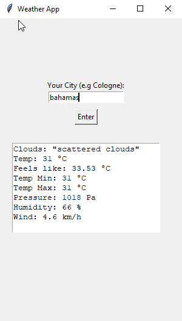

# Weather App

For this project I created a simple GUI with the Python Module *tkinter* and used a *http.client* to query the rapidapi.com *open-weather-map*-API.
To use this code you only have to enter your own API Key and you are good to go.
